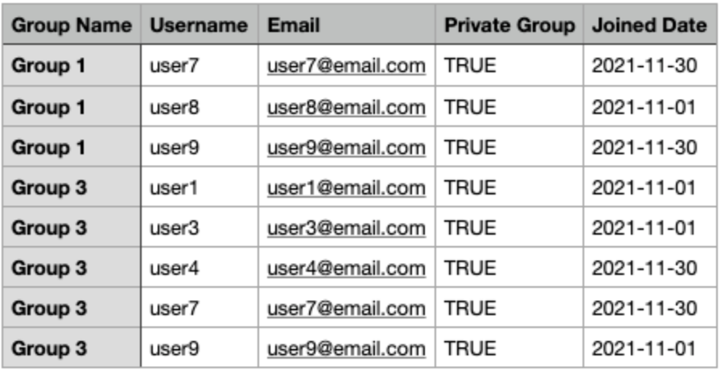
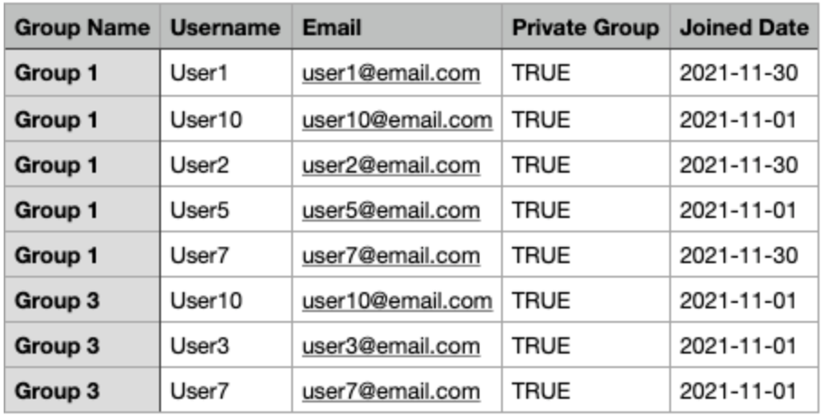

# Fullstack Engineer Test

## Overview

This repository contains solutions for the Fullstack Engineer Test, using Node.js, MongoDB and other technologies. The test includes two questions. Each question has its own set of code files and instructions.

## Prerequisites

- Node.js (v14.0.0 or later)
- MongoDB (v4.4 or later)
- npm (v6.0.0 or later)

## Setup

Create a .env file at the root of the project and add the following variables: MONGO_URI (or use configuration in env.developemt file).

## Directory Structure

The project directory is structured as follows:

- `schemas/`: Contains the schema files for the MongoDB models.
- `seeders/`: Contains the script to seed the MongoDB database with mock data.
- `export.js`: The code file for exporting data to a CSV file (Question 1).
- `updateUsernames.js`: The code file for updating the usernames in MongoDB (Question 2).
- `README.md`: This file providing instructions and information about the project.

## Dependencies

The project relies on the following dependencies:

- `mongoose`: For MongoDB database connectivity and querying.
- `csv-writer`: For writing data to a CSV file.

Please run `npm install` to install the required dependencies.

### Question 1

The goal of this question is to create a Node.js application that exports data from MongoDB to a CSV file. The data to be exported consists of usernames and emails of users who are members of private groups and joined the group in November 2021.

To run the code for Question 1, follow the steps below:

1. Ensure you have Node.js and MongoDB installed on your machine.
2. Install the required dependencies by running the following command: `npm install`
3. Ensure MongoDB connection URI configuration is corrected in the .env file.
4. Seed the MongoDB database with mock data by running the following command: `npm run seed`
5. After the seed data is generated, you can export the desired data to a CSV file by running the following command: `npm run export` or `node export.js`
6. The exported data will be saved in the `output.csv` file in the project's root directory.

**Export Result**

### Question 2

The objective of this question is to write a Node.js code that updates all the users' usernames in MongoDB by capitalizing the first letter of each username.

To run the code for Question 2, follow the steps below:

1. Ensure you have Node.js and MongoDB installed on your machine.
2. Install the required dependencies by running the following command: `npm install`
3. Ensure MongoDB connection URI configuration is corrected in the .env file.
4. Run the following command to execute the script that updates the usernames: `node updateUsernames.js` or `npm run update-users`
5. The script will connect to the MongoDB database, update the usernames, and then disconnect from the database.
6. After the script finishes running, you can check your MongoDB database to see the updated usernames.

**Export Result after capitalizing**

## Errors and Resolutions

**Error**: Cannot connect to MongoDB.

**Resolution**: Ensure that your MongoDB server is running and that the connection string in the .env file is correct.

## Contact

If you have any questions or need further assistance, please feel free to reach out.
Email : <weerapat.buachuen@gmail.com> or <farry.allen@gmail.com>
